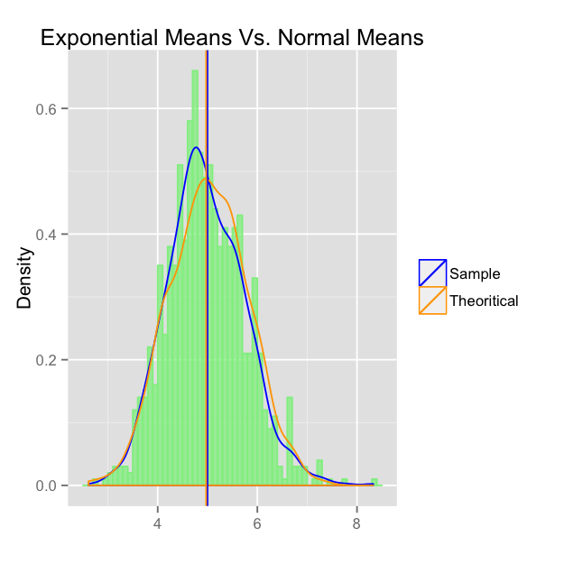

# Statistical Inference Course Project - Part 1
Trieu Tran  
September 21, 2015  
## Synopsis
This is the first part of the course project for the statistical inference class. The goal of this project is performing some statistical inference works such as, exploring inference by using simulation functionality of R to study the exponential distribution then comparing it with Central Limit Theorem.


```r
library(knitr)
library(ggplot2)

## checking existence of a folder named "figure", if not then creating one to store plot figures
figureDir <- 'figure'
if (!file.exists(figureDir)){
    dir.create(figureDir)
} 
```
## Simulations
### Random sampling from the exponential distribution 
The function rexp of R stat package creates random values belong to the exponential distribution; and it requires two input parameters, n - number of observations (n = 40) and rate (lambda = 0.2).  The plan is running this simulation function a thousand times, a fairly large number of trials, collecting arithmetic mean of each trial, determining mean and standard deviation of collected trial means.


```r
## initializing variables
set.seed(12345)
lambda <- 0.2
n <- 40
numSim <- 1000

## replicating random exponential sampling with sampling size n = 40, and repeat
## nSim = 1000 times, and storing sample data in a matrix
simMatrix <- replicate(numSim, rexp(n, rate = lambda))

## getting average for each column of the matrix
simColMeans <- colMeans(simMatrix)

## determining sample mean, sd and variance
sampleMean <- mean(simColMeans)
sampleSD <- sd(simColMeans)
sampleVar <- sampleSD^2
```

## Random sampling from the normal distribution
On the other hand, we use rnorm function to draw a thousand values from the normal distribution with mean equals to 1/lambda (mean = 1/lambda) and standard deviation equals to mean divided by square rooted of number of observation (sd = 1/lambda/sqrt(n)). 


```r
## calculating normal (theoritical) mean, normal standard deviation and variance
normalMean <- 1/lambda
normalSD <- 1/lambda/sqrt(40)
normalVar <- normalSD^2

## making a dataframe storing sample means and random value from the normal distribution
data <- data.frame(x = simColMeans, y = rnorm(1000, mean = normalMean, sd = normalSD))
```
## Plotting histogram and PDF of sample and PDF of theoritical distribution

```r
p <- ggplot(data, aes(x = x))
## adding histogram
p <- p +  geom_histogram(aes(y = ..density..), fill = I("lightgreen"), col = I("lightgreen"), alpha = 0.75, binwidth = 0.1) 
## adding density line of the sample distro
p <- p + geom_density(aes(colour = "1")) + labs(x = "", y = "Density", title = "") 
## adding density line of the normal distro
p <- p +  geom_density(aes(x = y, colour = "2")) 
## drawing sample mean
p <- p + geom_vline(color = "blue", xintercept = 1/lambda)
## drawing normal mean
p <- p + geom_vline(color = "orange", xintercept = sampleMean)
## labeling
p <- p + labs(x = "", y = "Density", title = "")
## adding legend
p <- p + scale_colour_manual(values=c("1"="blue", "2"="orange"), name="", labels = c("Sample", "Theoritical"))

ggsave(file.path(figureDir, "plot1.png"), width=6.4, height=4.8, dpi=124)
```


## Observation

```r
sampleMean
```

```
## [1] 4.971972
```

```r
normalMean
```

```
## [1] 5
```
1. The sample mean **4.9720** (the vertical blue line in the plot) is very close to the theoretical (normal) mean **5.0000** (the vertical orange line in the plot), as predicted

```r
sampleVar
```

```
## [1] 0.5954369
```

```r
normalVar
```

```
## [1] 0.625
```

2. Similiarity, variance of the sample is **0.5954**, also approximately equals to variance of the normal variance **0.6250**
3. From the above plot, the probability density functions of both sample and theoritical distribution almost overlaps each other. Or we can say that the distribution of the sample means follows the normal distribution, as stated in the Central Limit Theorem.
