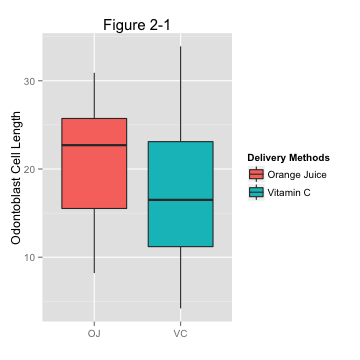

## Synopsis
This is the second part of the course project for the statistical inference class. The goal of this project is conducting some basic inferential data analysis on the "ToothGrowth"" data of R datasets package. The following is step-by-step execution and conlusion drawing from the analysis.

## Loading data
```{R echo=TRUE,results='hide',warning=FALSE,message=FALSE}
library(datasets)
library(ggplot2)

## checking existence of a folder named "figure", if not then creating one to store plot figures
figureDir <- 'figure'
if (!file.exists(figureDir)){
    dir.create(figureDir)
} 
data("ToothGrowth")
ToothGrowth$dose <- as.factor(ToothGrowth$dose)
```

## Data Exploratory
```{r echo=TRUE}
str(ToothGrowth)
```
"ToothGrowth" data is a set of 60 observations of 3 variables which are: 

- len - length of odontoblasts cell in each of 10 guinea pigs 

- supp - factor with two levels (OC, VC) to indicate delivery method of vitamin C supplement (Orange Juice - OC or ascorbic acid - VC)

- dose - dose of vitamin C supplements at three levels (0.5, 1 and 2 mg/day)

Read more about the dataset: [https://stat.ethz.ch/R-manual/R-devel/library/datasets/html/ToothGrowth.html](https://stat.ethz.ch/R-manual/R-devel/library/datasets/html/ToothGrowth.html)

### Group data by delivery methods
```{r echo=TRUE, warning=FALSE,message=FALSE}
## calculating means splitted by supplement type
meanOJ = mean(ToothGrowth[ToothGrowth$supp == "OJ", "len"])
meanVC = mean(ToothGrowth[ToothGrowth$supp == "VC", "len"])
meanOJ
meanVC
```

```{r echo=TRUE, warning=FALSE,message=FALSE}
## plotting boxplots on supplement type
p <- ggplot(ToothGrowth, aes(x = supp, y = len))
p <- p + geom_boxplot(aes(fill = supp)) 
p <- p + labs(x = "Supplement", y = "Odontoblasts Cell Length", title="Figure 2-1")
p <- p + scale_fill_discrete(name="Delivery Methods",
                         breaks=c("OJ", "VC"),
                         labels=c("Orange Juice", "Vitamin C"))

## save plot to a file
ggsave(file.path(figureDir, "plot2-1.png"), width=4.8, height=4.8, dpi=124)
```


```{r echo=TRUE, warning=FALSE,message=FALSE}
## plotting qqplot
p <- ggplot(ToothGrowth) + stat_qq(aes(sample = len)) + facet_grid(.~supp) + labs(title="Figure 2-2")

## save plot to a file
ggsave(file.path(figureDir, "plot2-2.png"), width=4.8, height=4.8, dpi=124)
```


### Group data by doses
```{r echo=TRUE, warning=FALSE,message=FALSE}
## calculating means splitted by dose
meanHalf = mean(ToothGrowth[ToothGrowth$dose == 0.5, "len"])
meanOne = mean(ToothGrowth[ToothGrowth$dose == 1, "len"])
meanTwo = mean(ToothGrowth[ToothGrowth$dose == 2, "len"])

meanHalf
meanOne
meanTwo
```

```{r echo=TRUE, warning=FALSE,message=FALSE}
## plotting boxplots on does
p <- ggplot(ToothGrowth, aes(x = dose, y = len))
p <- p + geom_boxplot(aes(fill = as.factor(dose))) 
p <- p + labs(x = "Dose", y = "Odontoblasts Cell Length", title = "Firgure 2-3")
p <- p + scale_fill_discrete(name="Dose",
                         breaks=c("0.5", "1", "2"))

## save plot to a file
ggsave(file.path(figureDir, "plot2-3.png"), width = 4.8, height = 4.8, dpi = 124)
```

```{r echo=TRUE, warning=FALSE,message=FALSE}
## quantile-quantile plots
p <- ggplot(ToothGrowth) + stat_qq(aes(sample = len)) + facet_grid(.~dose) + labs(title="Figure 2-4")
ggsave(file.path(figureDir, "plot2-4.png"), width = 4.8, height = 4.8, dpi = 124)
```


## Statistical Inference
### Hypothesis Tests
#### On delivery methods
```{r echo=TRUE}
varOJ = var(ToothGrowth[ToothGrowth$supp=="OJ", "len"])
varVC = var(ToothGrowth[ToothGrowth$supp=="VC", "len"])
varOJ
varVC
```
Let compare means between two groups of samples (with different delivery methods either OJ or VC).  Let Ho be the null hypothesis of equality of means, and let Ha be the alternative of unequality.  Variances of group receiving OJ **`r sprintf("%.4f", varOJ)`** and group receiving VC **`r sprintf("%.4f", varVC)`** are much different.  A two sided, unequal variance t-test will be performed as follows:

```{r echo=TRUE}
t.test(ToothGrowth[ToothGrowth$supp=="OJ", "len"], ToothGrowth[ToothGrowth$supp=="VC", "len"], paired = FALSE, var.equal = FALSE, alternative="two.sided")
```
We gather from the test results that the p-value is 0.06063 which is very small; and the 95% confident interval is from -0.1710156  to 7.5710156 which contains 0.  Therefore, we do not have enough evidence to reject the null hypothesis Ho.

#### On dosages
```{r echo=TRUE}
varHalf = var(ToothGrowth[ToothGrowth$dose == 0.5, "len"])
varOne = var(ToothGrowth[ToothGrowth$dose == 1, "len"])
varTwo = var(ToothGrowth[ToothGrowth$dose == 2, "len"])
varHalf
varOne
varTwo
```
We divide data into three groups named Group Half, Group One, and Group Two which, respectively received different doses of vitamin C supplement as of 0.5mg, 1mg and 2mg per day.  First, we perform a t-test on the Group One and Group Half with equality of means as the null hypothesis and inequality of means as the alternative hypothesis.

```{r echo=TRUE}
t.test(ToothGrowth[ToothGrowth$dose == 1, "len"], ToothGrowth[ToothGrowth$dose == 0.5, "len"], paired = FALSE, var.equal = FALSE, alternative="two.sided")
```
The p-value approximately equals to 0, and the 95% confident interval from 6.276219 to 11.983781 doesn't contain 0.  We have enough evidence to reject the null hypothesis and may say the increase of vitamin dosage from 0.5 to 1 mg per day has a positive effect on the length of tooth cells.

Then we run another t-test on the Group Two and the Group One with the same set of the null and alternative hypothesis
```{r echo=TRUE}
t.test(ToothGrowth[ToothGrowth$dose == 2, "len"], ToothGrowth[ToothGrowth$dose == 1, "len"], paired = FALSE, var.equal = FALSE, alternative="two.sided")
```
Again, the p-value is around zero, and the 95% confident interval from 3.733519 to 8.996481 doesn't contain 0.  The 2mg per day dosage has better impact then 1mg per day dosage.

We do not have to conduct a t-test between the Group Two and the Group Half for obvious reason.

## Conclusions:

* There is no evidence of the relationship between supplement delivery methods and length of odontoblasts cells 
* Increasing the dosage of vitamin C suplement per day has positive impact on length of odontoblasts cells 

## Assumptions:
- Due to lacking of information about data, so we assume that we have simple random samples from the population of guine pigs receiving vitamin C supplement.
- The populations are normally distributed.  By looking at quantile-quantile plots (Firgure 2-2, 2-4), we may say that all of them forming along straight lines (excepts OJ vs Len, and 1mg vs Len plots are more S-shaped) 
- We assume that data to be collected from 60 different Guinea pigs which received different supplement's delivery methods and doses. Therefore, when we divide Guinea pigs into different groups, we perform unpaired t-tests.