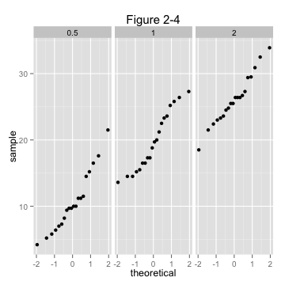

### Synopsis
This is the second part of the course project for the statistical inference class. The goal of this project is conducting some basic inferential data analysis on the "ToothGrowth"" data of R datasets package. The following is a step-by-step analysis followed by the conclusion drawn from this analysis.

### Data Exploratory
```{R echo=TRUE,results='hide',warning=FALSE,message=FALSE}
library(datasets)
library(ggplot2)

## checking existence of a folder named "figure", if not then creating one to store plot figures
figureDir <- 'figure'
if (!file.exists(figureDir)){
    dir.create(figureDir)
}

## loading data
data("ToothGrowth")
ToothGrowth$dose <- as.factor(ToothGrowth$dose)
```
```{r echo=TRUE}
str(ToothGrowth)
```

#### "ToothGrowth" Data Overview
"ToothGrowth" data is a set of 60 observations of 3 variables which are: 

- len - the length of odontoblast cells of 60 Guinea pigs 

- supp - a factor with two levels (OC, VC) indicating delivery methods of vitamin C supplement to the Guinea pigs (Orange Juice - OC or ascorbic acid - VC)

- dose - daily dose of vitamin C supplements at three levels (0.5, 1 and 2 mg/day)

Read more about the dataset: https://stat.ethz.ch/R-manual/R-devel/library/datasets/html/ToothGrowth.html

#### Group data by delivery methods
We divide the Guinea pigs into two groups by the delivery methods of supplement, and give the names for those groups as "OJ"" and "VC".

```{r echo=TRUE, warning=FALSE,message=FALSE}
## calculating means splitted by supplement type
meanOJ = mean(ToothGrowth[ToothGrowth$supp == "OJ", "len"])
meanVC = mean(ToothGrowth[ToothGrowth$supp == "VC", "len"])
```

The mean value of the group "OJ" is **`r sprintf("%.4f", meanOJ)`**; and the mean value the group "VC" is **`r sprintf("%.4f", meanVC)`**.

```{r echo=TRUE, warning=FALSE,message=FALSE}
## plotting boxplots on delivery methods
p <- ggplot(ToothGrowth, aes(x = supp, y = len))
p <- p + geom_boxplot(aes(fill = supp)) 
p <- p + labs(x = "", y = "Odontoblast Cell Length", title="Figure 2-1")
p <- p + scale_fill_discrete(name="Delivery Methods",
                         breaks=c("OJ", "VC"),
                         labels=c("Orange Juice", "Vitamin C"))

## save plot to a file
ggsave(file.path(figureDir, "plot2-1.png"), width=4.8, height=4.8, dpi=75)
```


From <strong>Firgure 2-1</strong>, we can say that it looks like Orange Juice has a better effect on the length of odontoblast cells.  However, we need to collect more evidence to support or reject this possibility.

```{r echo=TRUE, warning=FALSE,message=FALSE}
## plotting qqplot
p <- ggplot(ToothGrowth) + stat_qq(aes(sample = len)) + facet_grid(.~supp) + labs(title="Figure 2-2")

## save plot to a file
ggsave(file.path(figureDir, "plot2-2.png"), width=4.8, height=4.8, dpi=75)
```


<strong>Firgure 2-2</strong> is a quantile-quantile plot for determining if data either from "OJ" or from "VC" group follow the normal distribution. 

#### Group data by doses
Meanwhile, the Guinea pigs can be split into three groups by the amount of daily dose of vitamin C.  We name those groups "Half", "One" and "Two", as each subject within a group received a daily dose of 0.5mg or 1mg or 2mg, respectively.

```{r echo=TRUE, warning=FALSE,message=FALSE}
## calculating means splitted by doses
meanHalf = mean(ToothGrowth[ToothGrowth$dose == 0.5, "len"])
meanOne = mean(ToothGrowth[ToothGrowth$dose == 1, "len"])
meanTwo = mean(ToothGrowth[ToothGrowth$dose == 2, "len"])
```
Average values of each group: "Half" is **`r sprintf("%.4f", meanHalf)`** - "One" is **`r sprintf("%.4f", meanOne)`** - "Two" is **`r sprintf("%.4f", meanTwo)`**.

```{r echo=TRUE, warning=FALSE,message=FALSE}
## plotting boxplots on doses
p <- ggplot(ToothGrowth, aes(x = dose, y = len))
p <- p + geom_boxplot(aes(fill = as.factor(dose))) 
p <- p + labs(x = "Dose", y = "Odontoblast Cell Length", title = "Firgure 2-3")
p <- p + scale_fill_discrete(name="Dose",
                         breaks=c("0.5", "1", "2"))

## save plot to a file
ggsave(file.path(figureDir, "plot2-3.png"), width = 4.8, height = 4.8, dpi = 75)
```


<strong>Firgure 2-3</strong> shows that the tooth growth cells' length increases when the subjects has a higher daily dose of vitamin C.

```{r echo=TRUE, warning=FALSE,message=FALSE}
## quantile-quantile plots
p <- ggplot(ToothGrowth) + stat_qq(aes(sample = len)) + facet_grid(.~dose) + labs(title="Figure 2-4")
ggsave(file.path(figureDir, "plot2-4.png"), width = 4.8, height = 4.8, dpi = 75)
```


Data in each group mostly clusters around the straigh line of the normal distribution, as shown in <strong>Firgure 2-4</strong>.

### Statistical Inference
#### Hypothesis Tests on Delivery Methods
```{r echo=TRUE}
varOJ = var(ToothGrowth[ToothGrowth$supp=="OJ", "len"])
varVC = var(ToothGrowth[ToothGrowth$supp=="VC", "len"])
varOJ
varVC
```
We compare means between two groups of samples (with different delivery methods either OJ or VC).  Let Ho be the null hypothesis of equality of means, and let Ha be the alternative of unequality.  The variance of the "OJ"" group is  **`r sprintf("%.4f", varOJ)`**; and the variance of the "VC" group is **`r sprintf("%.4f", varVC)`**. These variances are much different.  A two sided, unequal variance t-test will be performed as follows:

```{r echo=TRUE}
t.test(ToothGrowth[ToothGrowth$supp=="OJ", "len"], ToothGrowth[ToothGrowth$supp=="VC", "len"], paired = FALSE, var.equal = FALSE, alternative="two.sided")
```
We gather from the test results that the p-value is 0.06063 which is very small; and the 95% confident interval is from -0.1710156  to 7.5710156 which contains 0.  Therefore, we do not have enough evidence to reject the null hypothesis Ho.

#### Hypothesis Tests on the Daily Doses
```{r echo=TRUE}
varHalf = var(ToothGrowth[ToothGrowth$dose == 0.5, "len"])
varOne = var(ToothGrowth[ToothGrowth$dose == 1, "len"])
varTwo = var(ToothGrowth[ToothGrowth$dose == 2, "len"])
varHalf
varOne
varTwo
```
First, we perform a t-test on the group "One"" and the group "Half" with equality of means as the null hypothesis and inequality of means as the alternative hypothesis.

```{r echo=TRUE}
t.test(ToothGrowth[ToothGrowth$dose == 1, "len"], ToothGrowth[ToothGrowth$dose == 0.5, "len"], paired = FALSE, var.equal = FALSE, alternative="two.sided")
```
The p-value approximately equals to 0, and the 95% confidence interval from 6.276219 to 11.983781 doesn't contain 0.  We have enough evidence to reject the null hypothesis and may say the increase of vitamin dosage from 0.5 mg to 1 mg per day has a positive effect on the length of tooth cells.

Then we run another t-test on the group "Two" and the group "One"" with the same set of the null and alternative hypotheses.

```{r echo=TRUE}
t.test(ToothGrowth[ToothGrowth$dose == 2, "len"], ToothGrowth[ToothGrowth$dose == 1, "len"], paired = FALSE, var.equal = FALSE, alternative="two.sided")
```
Again, the p-value is around zero, and the 95% confidence interval from 3.733519 to 8.996481; and doesn't contain 0.  The 2mg per day dosage has better impact than the 1mg per day dosage.

We do not have to conduct a t-test between the group "Two"" and the group "Half"" for the obvious reason.

### Conclusions:

* Delivery methods of vitamin C have no effect on the length of odontoblast cells.
* Increasing the dosage of vitamin C suplement per day has a positive impact on length of odontoblast cells. 

### Assumptions:
- Due to a lack of information about the data, we assume that we have simple random samples from the population of Guinea pigs receiving the vitamin C supplement.
- The sample is normally distributed.  By looking at quantile-quantile plots (Firgure 2-2, 2-4), we may say that all of them form along straight lines (excepts OJ vs Len, and 1mg vs Len plots which are more S-shaped) 
- We assume that the data was collected from sixty different Guinea pigs; and each of which received one of three different supplement doses via a one of two different delivery methods.  This requires the need of unpaired t-tests.